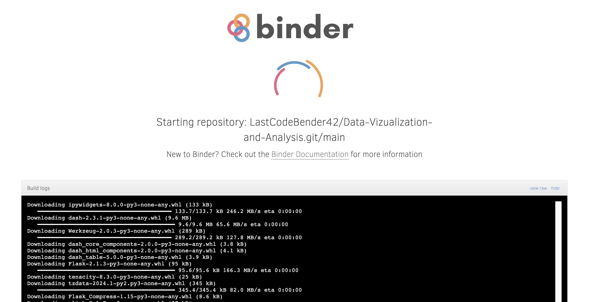
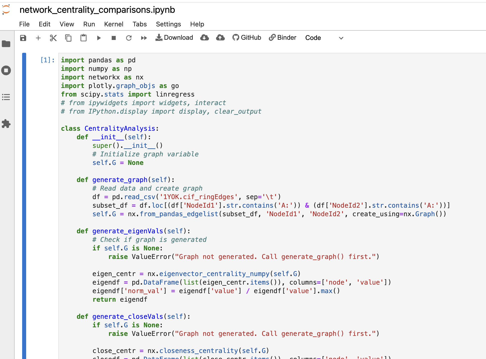
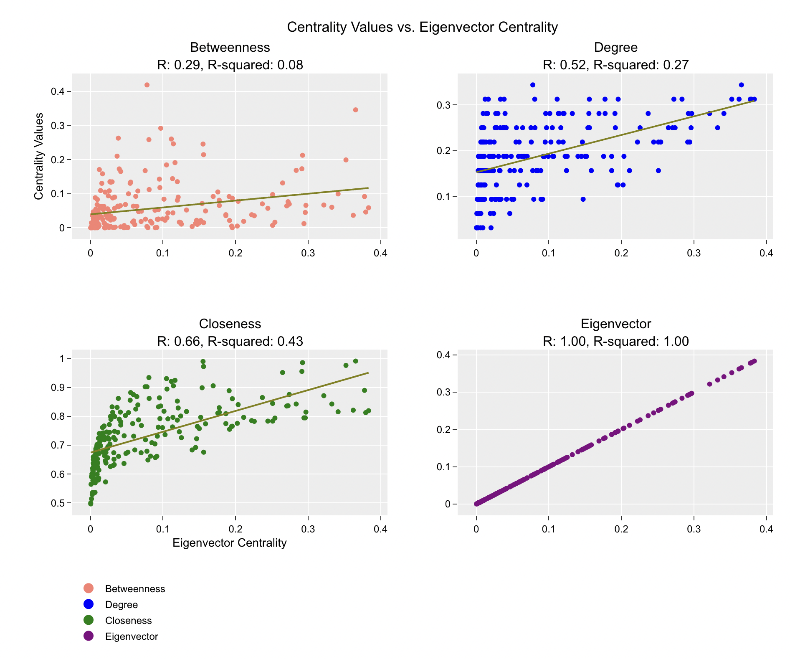

# Protein Structure Network Analysis

# Interactive Data Visualizations with Binder

Thank you for visiting my code repository! I have organized these Jupyter Notebooks to be hosted on Binder, a platform that provides cloud-based environments for running code interactively. One thing to note is that when launching a Binder environment, it may take a few minutes for the Docker image to start up and for the environment to become fully accessible. This startup time is normal and can vary depending on factors such as the size of the environment and the availability of resources. I wanted to mention this in advance to avoid confusion or misunderstanding.

After selecting the "launch binder" widget 

 

 

the Binder homepage will appear displaying the docker initialization:

 

 

Once the Jupyter Lab opens, run each of the cells by pressing `SHIFT + RETURN` 

 

 

and, after the last cell is run, the interactive data visualization will display:

 

 

If you have any questions or concerns about this, please feel free to let me know. Looking forward to our discussion!
